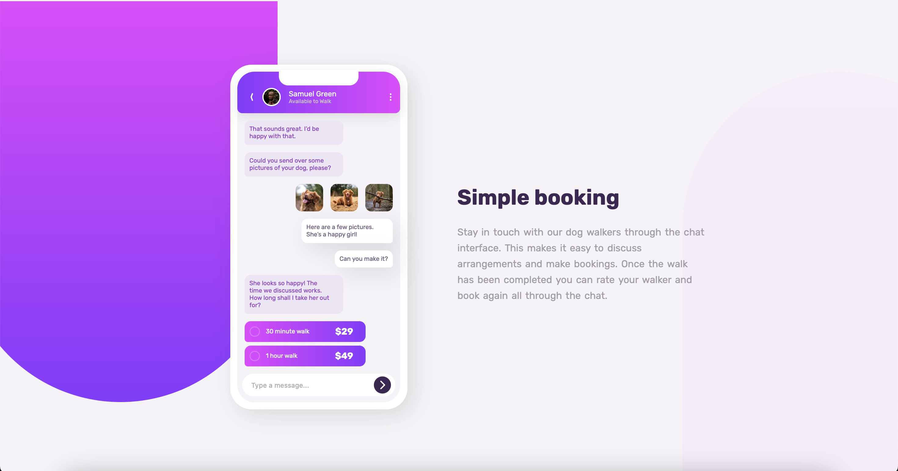

# Frontend Mentor - Chat app CSS illustration solution

This is a solution to the [Chat app CSS illustration challenge on Frontend Mentor](https://www.frontendmentor.io/challenges/chat-app-css-illustration-O5auMkFqY). Frontend Mentor challenges help you improve your coding skills by building realistic projects. 

## Table of contents

- [Overview](#overview)
  - [The challenge](#the-challenge)
  - [Screenshot](#screenshot)
  - [Links](#links)
- [My process](#my-process)
  - [Built with](#built-with)
- [Author](#author)

## Overview

### The challenge

Users should be able to:

- View the optimal layout for the component depending on their device's screen size
- See the chat interface animate on the initial load

### Screenshot

### Links

- Solution URL: [Add solution URL here](https://your-solution-url.com)
- Live Site URL: [Add live site URL here](https://kms4u.github.io/Chat_app_CSS_illustration/)

## My process

### Built with

- Semantic HTML5 markup
- CSS custom properties
- Flexbox
- JQuery
- [https://tabler-icons.io](TablerIcons)

## Author

- Website - [Sokolov Pavel](https://kms4u.github.io/Sokolov_Web/)
- Frontend Mentor - [@kms4u](https://www.frontendmentor.io/profile/kms4u)
